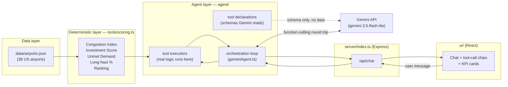

# Design Document — Airport Investment Intelligence Agent

This document explains **how the system is built and why**: the scoring math, the tradeoffs behind each major decision, and exactly where AI is used versus where plain code does the work. It's written for a reader who wants the reasoning, not just the code.

For "how do I run this," see [README.md](./README.md).

---

## 1. Architecture overview

The core design rule: **deterministic code computes every number; the LLM only explains numbers it's handed.** Nothing in this system asks Gemini to calculate a score, a percentage, or a ranking — it narrates results that already exist.



**Why this boundary matters**: the assignment explicitly requires "deterministic scoring or ranking logic (not only LLM output)." An LLM can produce a plausible-sounding score, but it can't guarantee the same input always produces the same output, and it can silently invent a number that has no basis in the underlying data. Every score in this app is computed once, by a pure function, and is reproducible — the LLM's only job is to read that computed result and put it into a clear sentence.

Concrete proof this holds in practice: a live test asked the agent about SFO's unmet demand. Its answer cited "62.7% utilization" and "29.5% flights delayed" — numbers that match `tools/scoring.ts`'s output exactly, because that's literally where they came from. The system prompt (see §4) also explicitly forbids the model from computing or estimating any number itself.

---

## 2. Data layer

### 2.1 What's in `data/airports.json`

38 US airports, split into two tiers of confidence:

| Tier | Count | How it was built |
|---|---|---|
| **`full`** | 16 (ANC, SFO, LAX, SNA, BOS, PVD, BDL, MHT, PWM, BGR, BTV, JFK, ORD, ATL, DFW, DEN) | Hand-curated, one field at a time, each with a cited source |
| **`screening`** | 22 | Pulled programmatically by `scripts/build-screening-tier.ts` from the same public sources |

The 16 "full" airports were chosen for a reason, not at random:
- **ANC, SFO, LAX, SNA** — the 4 assignment test-case airports. Non-negotiable.
- **BOS, PVD, BDL, MHT, PWM, BGR, BTV** — every commercial airport across all 6 New England states, because "which New England airports are strong candidates" requires *several* real data points from the region, not one.
- **JFK, ORD, ATL, DFW, DEN** — large hubs added for geographic spread and to sanity-check the scoring formulas against very different airport sizes (a formula that only looks reasonable on medium airports isn't trustworthy).

The 22 "screening" airports exist so `screen_investment_candidates` has a non-trivial pool to rank, without spending manual-curation time on airports no test case asks about.

### 2.2 Sources, and where they hit a wall

| Field | Source | Confidence |
|---|---|---|
| Runway count, coordinates | [OurAirports](https://ourairports.com) (public domain CSV) | `sourced` |
| CY2019 / CY2024 enplanements | FAA CY Passenger Boarding data (`.xlsx`) | `sourced` |
| Terminal/runway capacity | Derived heuristic (§3.2) | `estimated` |
| Long-haul route share | Destination-count proxy (§3.4) | `estimated` |
| Delay rate | National-baseline-anchored estimate, a few real citations (§3.5) | mostly `estimated`, a few `sourced` |

**Why two fields are estimated instead of pulled from official BTS data**: the plan was to use BTS T-100 (route mix) and BTS On-Time Performance (delays) — both are the *right* official sources. In practice, neither is bulk-downloadable without a login: TranStats requires an interactive multi-step form with no direct-download URL, and the Socrata API behind `datahub.transportation.gov` returns "you must be logged in" to an unauthenticated request. Full details and the URLs tried: [`research/aviation-data-sources.md`](./research/aviation-data-sources.md).

Rather than leave those fields blank, every airport gets a **documented, reasoned estimate** instead — and every one of them is labeled `confidence: "estimated"` end to end, from the JSON field through the API response to a visible badge in the UI (§6). This is the assignment's "communicate uncertainty" requirement, implemented as data, not just as a sentence in this document.

An optional follow-up ([issue #13](https://github.com/OfekSarusi/airport-investment-intelligence-agent/issues/13)) tracks upgrading these two fields to real BTS data via an authenticated API, if there's time — it doesn't block anything else.

---

## 3. Scoring methodology

All formulas live in [`tools/scoring.ts`](./tools/scoring.ts) as small, independently testable, pure functions — no network calls, no LLM, no side effects.

### 3.1 Capacity Utilization

```
capacityUtilizationPct = CY2024 enplanements / estimated annual passenger capacity × 100
```

The simplest and most direct answer to the assignment's actual question — "where will renovation be most profitable based on **increased flight and passenger capacity**" is, at its core, a question about how close an airport already is to its ceiling.

### 3.2 Capacity heuristic — how "capacity" is estimated

No public dataset publishes actual terminal design capacity for a general set of US airports. Rather than leaving this blank, every airport uses one uniform, documented formula:

```
annualPassengerCapacity = openRunwayCount × 10,000,000
```

Derivation:
1. FAA Advisory Circular 150/5060-5 ("Airport Capacity and Delay") benchmarks a single independently-operated runway at ~50–60 operations/hour.
2. Assuming ~250,000 operations/year at high utilization (a range single-runway airports like London Gatwick — the world's busiest single-runway airport — approach in practice).
3. A blended US industry average of ~85 enplaned passengers per departure (roughly half of all operations).
4. `250,000 × 0.5 × 85 ≈ 10.6M`, rounded to a clean 10M/runway.

**This is a planning-level estimate, not an authoritative number**, and it visibly breaks down in a few places — which is worth stating plainly rather than hiding:
- **ATL** and some screening-tier airports (e.g. SAN) compute to **over 100% utilization**, because a single constant can't capture every runway configuration, aircraft mix, or terminal/gate limit.
- **ANC** is one of the world's top cargo airports by landed weight — a large share of its runway use is all-cargo freighter traffic this passenger-only heuristic doesn't see, so its utilization is likely *understated*.
- **BGR**'s runway is an oversized ex-Strategic Air Command runway, built for military bombers, not sized to its actual civilian traffic.

### 3.3 Growth: a 5-year CAGR that skips COVID on purpose

```
CAGR = (CY2024 enplanements / CY2019 enplanements) ^ (1/5) - 1
```

2020–2023 data exists and is real, but including it in a growth calculation would mix in a global pandemic collapse and recovery bounce that has nothing to do with an airport's underlying investment case. Anchoring the two endpoints on **2019** (the last full pre-COVID year) and **2024** (the latest year with a finalized, non-preliminary FAA figure) means the distorted years never enter the formula at all — no smoothing or correction needed, because there's nothing to correct.

### 3.4 Long-haul share — a proxy, not the official BTS number

```
longHaulSharePct = (unique nonstop destinations ≥ 2,000 miles) / (all unique nonstop destinations) × 100
```

The "correct" measure would be BTS T-100's *flight-and-passenger-weighted* long-haul share (accounting for how often a route flies and how big the aircraft is). That data isn't accessible here (§2.2), so this uses a **destination-count proxy** instead: count how many of an airport's current nonstop destinations are far enough to count as long-haul, out of all destinations.

This can differ from the "real" BTS number — e.g. if an airport's one long-haul route flies daily on a wide-body while ten short-haul routes fly twice a week each, the true passenger-weighted share is higher than a simple destination count suggests. The direction of the answer is reliable; the exact percentage carries the uncertainty the `estimated` badge is there to flag.

Worked example — **ANC**: 3% long-haul, essentially one route (Condor's seasonal Anchorage–Frankfurt service). Despite ANC's fame as a top-5 world cargo airport, its *passenger* traffic is almost entirely short/medium-haul intra-Alaska and Lower-48 connections — a genuine finding about ANC, not an artifact of the method.

### 3.5 Delay rate

Anchored to the real CY2024 national baseline (20.3% of flights delayed >15 min, per BTS's Air Travel Consumer Report), adjusted per airport based on known congestion drivers. A few airports carry a directly-cited figure instead of an estimate — **SFO (29.5%)**, **ATL (18.4%)**, **DFW (23.7%)** — sourced to press coverage of a DOT OIG report that happened to publish per-airport numbers.

### 3.6 Congestion Index

A single 0–100 score blending two inputs:

| Component | Weight |
|---|---|
| Capacity utilization | 60% |
| Delay severity | 40% |

Both are normalized to 0–100 before blending (utilization caps its score contribution at 100% even if the raw percentage exceeds it, e.g. ATL; delay severity saturates at 40% delayed, well above the worst figure in this dataset, so real data never gets clipped at the edge of its own range).

This is also a **user-facing KPI in its own right**, not just an internal input — `compare_airports` returns it directly, because "compare congestion levels" (test case 2) is asking about this number specifically, separately from the overall investment ranking.

### 3.7 Investment Opportunity Score — and the weights that aren't what they look like

A single 0–100 score, the main ranking signal for `screen_investment_candidates`:

| Input | Headline weight |
|---|---|
| Capacity utilization | 35% |
| Congestion Index | 35% |
| Growth (CAGR-based) | 30% |

**These headline numbers are misleading on their own**, because the Congestion Index already contains utilization at 60% weight internally. Expanding the formula out:

```
Investment Score = 0.35·utilization + 0.35·(0.6·utilization + 0.4·delay) + 0.30·growth
                 = 0.56·utilization + 0.14·delay + 0.30·growth
```

**The real, effective weights are 56% utilization / 14% delay / 30% growth**, not 35/35/30. This isn't a bug — it's intentional: capacity utilization is the single clearest, most directly measurable signal of a capacity/demand mismatch, which is exactly what the assignment's stated goal is about, so it's deliberately the dominant input across both layers. But a reader who only sees "35/35/30" would reasonably ask "why not just weight utilization at 100%?" — and the honest answer is that the effective weight already leans heavily that way; the split into three named components (rather than one) exists so the Congestion Index and growth trend still show up as separately-inspectable, meaningful sub-scores in their own right (e.g., for the congestion-specific question in test case 2), not just buried inside one number.

### 3.8 Unmet demand — a second, non-obvious signal found by testing

The first version of "unmet demand" was a simple projection: `max(0, (current pax × (1 + CAGR)) − capacity)`. Running it against real SFO data during development exposed a problem: SFO's CAGR is currently *slightly negative* (it hasn't fully recovered its pre-2019 passenger peak), so this check said SFO was "not constrained" — flatly contradicting SFO's well-documented, chronic congestion problem.

The fix was a second, independent signal:

```
isOperationallyStrained = utilization ≥ 50%  AND  delayRate ≥ (national baseline + 5 points)
```

An airport can be flagged as having unmet demand through *either* signal — a raw volume projection crossing the capacity ceiling, **or** already-visible operational strain (high utilization and elevated delays) even while under that ceiling. The reasoning: a high delay rate at moderate-to-high utilization is itself evidence that *effective* capacity (weather, runway configuration, air traffic constraints) is tighter than a passenger-volume heuristic alone can see — SFO's fog-driven parallel-runway restrictions being the textbook example.

This second signal was checked for false positives across the full dataset before being kept: **only SFO, JFK, and EWR** trigger it — the three airports most widely known for chronic weather/congestion-driven delays. It generalizes; it isn't tuned to make the SFO test case pass.

---

## 4. Agent & tool design

### 4.1 The five tools

| Tool | Backs |
|---|---|
| `get_airport_details(iata_code)` | A full KPI breakdown for one airport |
| `compare_airports(iata_codes[])` | Side-by-side comparison — test case 2 |
| `screen_investment_candidates(region?, min_score?)` | Ranking/filtering — test case 1 |
| `calculate_long_haul_stats(iata_code)` | Long-haul share — test case 3 |
| `get_unmet_demand_analysis(iata_code)` | Unmet demand + why — test case 4 |

Each is a thin wrapper: it looks up the airport in `data/airports.json` and calls straight into `tools/scoring.ts`. No tool contains scoring logic itself.

### 4.2 Where the boundary actually lives

Two separate files draw a hard line between "what Gemini sees" and "what actually runs":

- **`agent/tools.ts`** — pure JSON Schema declarations (name, description, parameters). This is the *only* thing sent to Gemini. It contains zero logic.
- **`agent/toolExecutors.ts`** — the real implementation, running entirely on this server. Gemini never sees this code, only the JSON result it returns.

The system prompt (`agent/geminiAgent.ts`) reinforces this explicitly:

> "Every number you state ... MUST come from a tool call result. Never compute or estimate a number yourself."
> "When you use an 'estimated' figure, say so explicitly ... do not present estimates as if they were official statistics."

### 4.3 Multi-turn conversation

Built on Google's Interactions API (`client.interactions.create`), which tracks conversation history **server-side** via a chained `previous_interaction_id` — this app only needs to remember the last interaction ID per session, not resend a full message history on every turn. Verified live: asking "What's the long-haul share at ANC?" followed by "How does that compare to SFO?" correctly resolved "that" without re-naming the airport.

### 4.4 How this could map to MCP (not implemented, and why)

The Model Context Protocol (MCP) standardizes how tools are exposed *across different AI applications* — e.g. letting the same tool server serve both a custom chat app and Claude Desktop. This app has exactly one consumer (its own chat UI), so that cross-application problem doesn't exist here, and a real MCP server would add a separate process, a transport layer (stdio/SSE), and JSON-RPC handling for zero functional gain over the current in-process function calls.

If this ever needed to change, the path is short: the tool declarations in `agent/tools.ts` are already shaped exactly like MCP tool definitions (name, description, JSON Schema parameters), and `agent/toolExecutors.ts`'s functions are already pure and decoupled from Gemini specifically — wrapping them in an MCP server would mean writing a thin adapter, not restructuring the app.

---

## 5. Key tradeoffs

| Decision | What was chosen | Why |
|---|---|---|
| **LLM provider** | Gemini API, free tier | Zero-cost requirement; Gemini is the only one of Gemini/OpenAI/Claude with a genuine no-billing free tier |
| **Model** | `gemini-3.5-flash-lite` | The newer, more capable `gemini-3.7-flash` hit a free-tier rate limit (`limit: 5`) after a single call during live testing — switched for a safer demo-time quota margin |
| **Live vs. static data** | Fully static/historical | The suggested live FAA endpoint doesn't resolve; all 4 test cases are answerable from historical data alone |
| **MCP** | Not implemented | Single consumer, no cross-app tool-sharing need (§4.4) |
| **Docker** | One container, backend + built UI together | Simplicity for a unified Node/TypeScript stack; a real multi-service production deployment would likely split them |
| **Backend build** | Runs via `ts-node`, even in the Docker image | No separate compile step or `dist/`-path juggling for a 1-day project; costs a slower cold start, not correctness |
| **Session state** | In-memory only (server), `localStorage` (browser) | Correct for a demo; would need a real store (Redis, a DB) for multi-instance production |
| **Data scope** | 16 hand-curated + 22 script-generated airports | Enough to answer every test case and support meaningful ranking, without hand-curating a full national dataset in a day |
| **Voice input** | Deferred, best-effort only if time remains | Explicitly a "bonus" in the assignment; not worth risking the core deliverable's time budget |

---

## 6. Communicating uncertainty — beyond just this document

The assignment asks that assumptions and uncertainty be communicated clearly. Concretely, in this app, that isn't only this document — it's implemented as actual product behavior:

- Every metric in `data/airports.json` carries a `confidence: "sourced" | "estimated"` field, all the way through the API response.
- The UI renders this as an **always-visible badge** next to the number it applies to — a quiet green dot for "sourced," a distinct amber pill for "estimated" — deliberately never hidden behind a hover tooltip a user might not find.
- The agent's system prompt requires it to say so out loud in its answer whenever it uses an estimated figure, rather than presenting it with false authority.
- Investment Score and Congestion Index aren't shown as bare numbers — the UI renders each as a 0–100 bar with its own component sub-bars, so the deterministic breakdown behind a score is visually inspectable, not just asserted in prose.

---

## 7. Known limitations / future work

- **Real BTS T-100/On-Time-Performance data** — tracked as an optional follow-up ([issue #13](https://github.com/OfekSarusi/airport-investment-intelligence-agent/issues/13)) to replace the estimated long-haul/delay fields with authenticated-API-sourced figures.
- **A live congestion overlay** — if this became an ongoing analyst tool rather than a point-in-time scoring exercise, layering live status data (e.g. `nasstatus.faa.gov`) on top of the static baseline would let it distinguish a chronic, structural bottleneck from a one-off weather delay today. Deliberately out of scope for this deliverable.
- **In-memory session state** — fine for a demo; a real deployment serving multiple users across multiple server instances would need shared, persistent session storage.
- **The capacity heuristic is a single constant** — a more precise model would vary by runway length, aircraft mix, and terminal/gate count, but that level of precision isn't supported by any of the public datasets available in this timeframe anyway.
